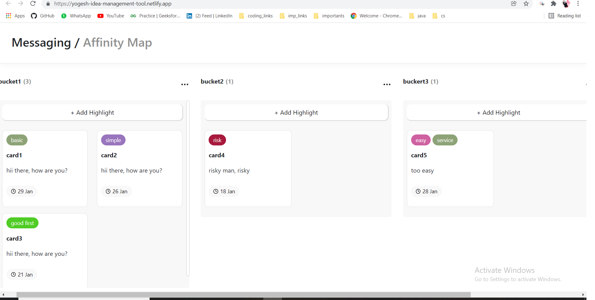

# Ideam Management Tool
- `url` https://yogesh-idea-management-tool.netlify.app

## Tech Stack
`react.js`, `Bootstrap5`

## Features
- Ability to add/remove/edit highlights
- Ability to add/remove/edit highlights
- Ability to group highlights into buckets
- Ability to move highlights from one bucket to another.

## How to get started
- Your machine must have latest versions of `node.js` and `git`.
- Do `git clone https://github.com/yogesh-kansal/IMT.git`.
- Go to `IMT` directory.
- Do `npm install` in terminal.
- To start client do `npm start` in terminal.

## Demo images
### Home page -

 
 

### Edit Highlight -

 
 